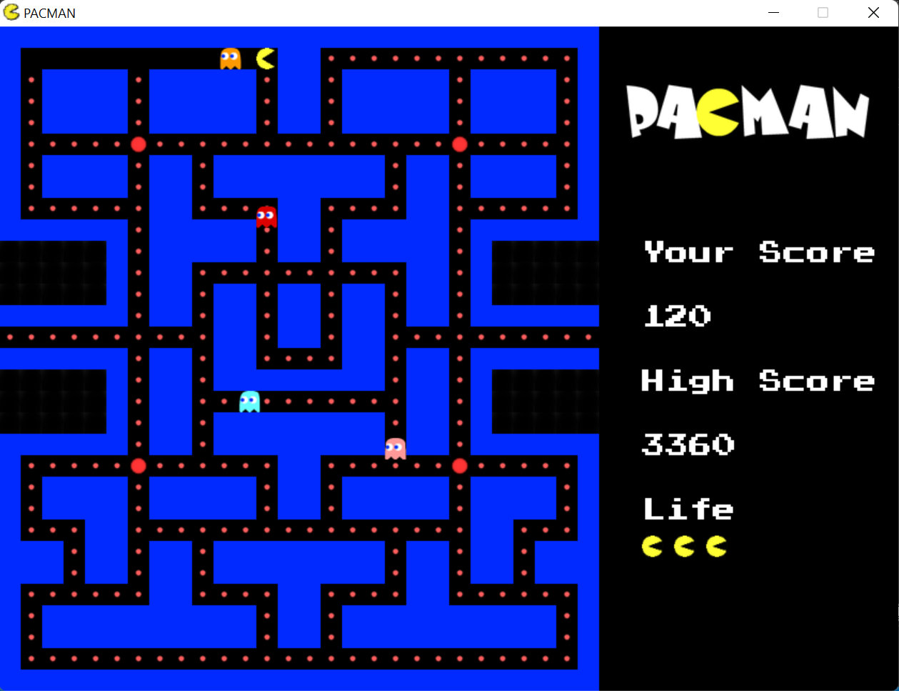

# Pacman

## What is it?
A cute Pacman game. There are four ghosts chasing Pacman using different methods: A* search, search by Manhattan distance, etc. Run away before they can catch you!

## How to use it?
The program is compatible with `Windows 11`. Just run the executable `Pacman.exe` and enjoy!

## Technical details
The game was built by C++ using Simple DirectMedia Layer `SDL2` graphic library, with `MinGW` compiler.

## Screenshot

